# NgspiceSky130-Day1-Basics of NMOS Drain Current(Id) vs Drain-to-source Voltage(Vds)

## Introduction to Circuit Design and Spice Simulations

### L1 Why do we need SPICE simulations?
The circuit includes PMOS and NMOS gates connected to form logic gates such as NAND, NOR, OR, AND, etc. 

The above inverter will have the following characteristics. We'll run a SPICE simulation to determine the delay and thus obtain the W/L ratio for a specific transistor. 

**WHY DO WE NEED SPICE?** 
The clock tree synthesis, crosstalk, and clocking are all built using SPICE (a simulation program with an emphasis on integrated circuits). Without SPICE, there would be no delay, and without delay in the physical design process, crosstalk is meaningless. 

Let's assume we've synthesized a clock tree for the circuit shown below, with buffers and varying capacitive loads at the output. 

After the SPICE simulation, we obtain a "Delay Table," which includes the input step and output load. The intersection of the input step and output load is considered the delay. Delay tables for level 1 and level 2 buffers are presented. They were calculated using schematic design and simulation. 

The source of the delay tables above is schematic design using SPICE simulation. SPICE simulation is used to characterize any CMOS logic. 

### L2 Introduction to the Basic Element of Circuit Design – the NMOS Transistor
The NMOS transistor consists of a p-type substrate heavily doped with an n+ region. It has an isolation region that isolates the transistor from other transistors. The N+ regions are the source and drain. Above this is an oxide layer, and above that is a metal layer, which is the gate terminal. 

**Threshold Voltage**
This is a very important term; all characteristics depend on the threshold voltage. 
Initially, we'll assume Vgs = 0, meaning the source and drain terminals are grounded. The case is also grounded. The P-substrate and N+ junction act as a PN junction diode, and since there is no potential, the resistance is high. Channels are not formed. 

Now we apply a positive potential; Vgs>0. We'll see that the gate is now positively charged, causing negative charges to accumulate on the substrate surface. 

### L3 High Inversion and Threshold Voltage
Due to the accumulation of negative charges, a depletion region is formed, which will deplete the majority of charge carriers, i.e., positive carriers. 

Now we'll increase the gate voltage even further. We'll see that positive charge carriers will repel each other, and the width of the depletion region will increase. As the gate voltage increases further, we'll reach a point where the surface inverts into an n-type material. This is called "surface inversion" or "strong inversion." The gate voltage Vgs at which strong inversion occurs is called the "threshold voltage." 

What happens if we increase Vgs even more? Since there are no longer any negative charges that could be attracted to the positive potential Vgs, negative charges from the n+ region will be attracted, and a channel will form on the surface. 

Current can now flow from the source to the drain. The channel spans the gap between the source and drain regions. But since there's no drain voltage, electrons don't move, and this is now the "cutoff region." 

Let's see what happens if we change the potential of the "Body" pin. 

There will be increase in depletion region between source and body terminal.  

### L4 Threshold voltage with positive substrate potential
If we increase Vgs, we will see that the depletion region increase in both the cases. But, in second case as there is Vsb +ve, few charges from channel will be pulled towards the source. 

Due to this the surface inversion will be slower in second case. Therefore some extra potential has to be apllied in second case to create inversion. 

The parameters such as Gamma comes from foundaries after simulation of which in SPICE we get the value for Vt (Threshold Voltage). 

## NMOS resistive region and Saturation region of operation

### L1 Resistive region of operation with small drain-source voltage
Previously, we saw Cut Off region operation, now we will see the "Resistive region"/"Linear Region" of operation by applying Drain-source voltage.
If we keep on increasing the Gate-source voltage, the channel width keeps on increasing. 

This shows that the net Induced charges is propotional to (Vgs-Vt). Now let's apply very small Vds at start. And keep Vt=0.45V, Vgs also small initially. 

We can see that the source is grounded and Drain is at some potential, so there will be a voltage gradient accross the channel. 

Also, the Effective channel length is much lesser than the original channel length. 

Here, y axis represents the width of transistor and x axis is the voltage across the channel. 
On applying Vds, every point on x axis will vary w.r.t to Vgs-V(x), this will decide the current equation. 

### L2 Drift current theory
We know the effective channel voltage will vary w.r.t x, for example at x=0, Vgs=1V and V(x)=0, So the Vgs-Vx=1V. At x=Vds=0.05V, Vgs-Vx=0.95V. Now if we see the induced chagre equation, it is proportional to the effective channel voltage. 

There are two types of currents; Dift and Diffusion current, Here there is Drift current as there is potential difference across the channel. 

To get the drain current, we will see the top view of transistor. 

### L3 Drain current model for Linear region of operation
As there is change of voltage across the channel length, this will result in change of velocity which is a function of mobility and electrci field. 

We will integrate the above equation, where limits of dV will be from 0 to Vds and limits of dx will be from 0 to L. 

Here, Cox, W/L, Vgs, un and Vt are the 'technology parameters', we will simulate usinf SPICE and find out the characteristics. 

But, here we cannot say that it is in Linear region, since the Drain current is the quadratic function of Vds. We will calculate the Id with the given values. 

When (Vgs-Vt)>=Vds, It is in "Linear region". 

### L4 SPICE conclusion to resistive operation
We need to find the impact of Vgs and Vds on the drain current equation. We will consider different values of Vgs and Vds. If we consider different values of Vgs, under what condition the device will remain in Linear region depends on (Vgs-Vt) should be greater than Vds. 

Now the main question arises: how to calculate Id for different Vgs values ​​and, at each Vgs value, scale Vds to (Vgs - Vt) using the linear equation for Id?

To do this, we need to perform a SPICE simulation.

### L5 Cutoff Region Condition
There is also a region of operation where the drain-source voltage exceeds (Vgs - Vt). This region of operation is called the "saturation region."
We know that the channel voltage is equal to Vgs - Vds. Now let's increase Vds. 

When Vgs-Vds is greater than Vt, a conductive channel is formed. 
When Vgs-Vds equals Vt, an inversion occurs on the drain side, since Vds equals Vt, so the channel on the drain side begins to disappear. 

Now, when the channel begins to disappear, this is called the "clipping region." 

When Vgs-Vds<Vt, we won't see any channels on the drain side. 

This state is called the "saturation region," where the MOSFET is saturated and cannot conduct further. 

### L6 Drain Current Model for the Saturation Region
In the saturation region, the channel voltage will remain constant, as Vgs - Vt, and the drain current will be independent of Vds. 
To obtain the drain current equation in the saturation region, replace Vds with Vgs-Vt. 

Now we see that, according to the equation, the MOSFET acts as an ideal current source. But this is incorrect: as Vds increases, the drain depletion region increases, further reducing the channel length. Therefore, we observe a slight dependence of Vds on Id. 

This is called "channel length modulation." 

## Introduction to SPICE

### Basic SPICE L1 Setup
First, let's look at the SPICE setup. 

Some parameters are constant, and since they come directly from the founders, we don't need to display them. They are circled in yellow. 

So, when we pass the SPICE model parameters and the SPICE netlist to the SPICE program, we get the device characteristics in terms of Id and Vds with different Vgs values. 

**SPICE Netlist**
We need to pass the device to SPICE Engine with a specific Thus, the circuit equivalent of this MOSFET is shown below.  

### Description of the L2 circuit in SPICE syntax
Now let's write the syntax for this specific circuit into a SPICE netlist. To do this, we need to complete a few steps:
* **Define the nodes**

* **Name the nodes**
* **Write the code**
`Since the modfet has 4 pins, it sits between 4 different nodes, similarly, the resistor sits between 2 nodes.`

The fashion in which it is written is "Drain", "Gate", "Source", and "Substrate" (DGSS). 

this is a long channel mosfet.

Similarly we can write for Resistor. 

### L3 Define Technology parameters
Now we will look for model of this particular NMOS. For this we have model paramters, and it becomes easy to model from the parameters. That is where the technology file comes into picture. The models for the name NMOs will be found in file which has the attribute of the similar name. 

Inside the brackets, technology paramteters will exist. Similarly for pmos also. 

Now, we just plug in this packaged file in `.mod` file and call this file in top level SPICE netlist. 

In the above image, the highlighted part is comment in SPICE. 
Now, we need to sweep the Vgs and Vds for SPICE simulations. 

### L4 First SPICE simulation
* Open Virtual box
* Type `cd`
* `git clone https://github.com/kunalg123/sky130CircuitDesignWorkshop.git`
  inside the `sky130_fd_pr` directory we will see cells, models and tech files. 

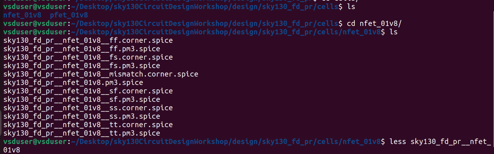

In the `cell` files, we'll see the `nfet` and `pfet` cells we'll be using. 

In the `nfet` file, we'll see the SPICE libraries at various angles. Let's choose one of these typical angles. 

We'll see all the model parameters needed for the process. 
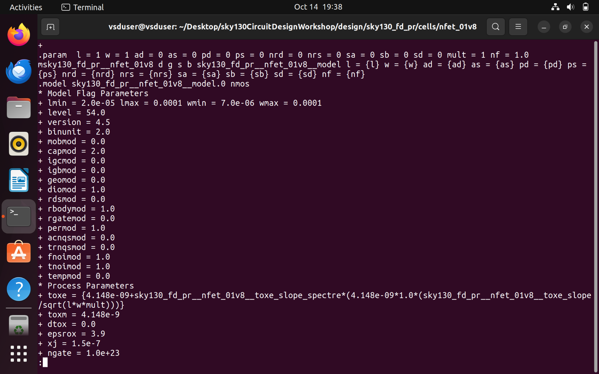

We have various values ​​for W and L, which are described in advance. For the simulation, we need to select any value from the library. 

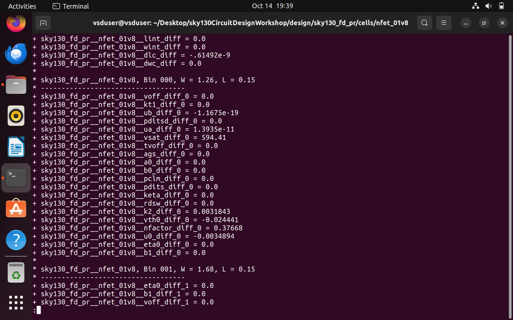

Now go to the `models` -> `lib.spice` file. We'll see the library files for nfet and pfet. Angle files are available, including typical angle files, slow-fast angle files, and fast-fast angle files. 

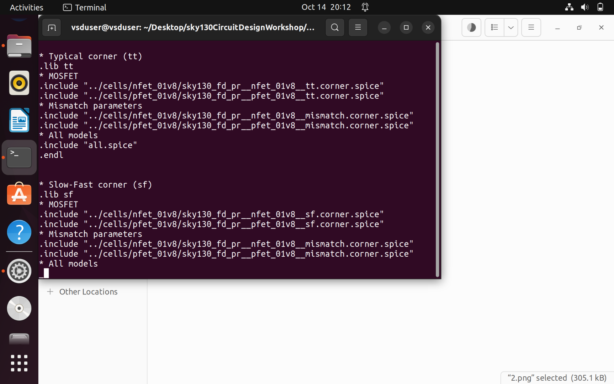

Inside `design` --> open the file day1. 

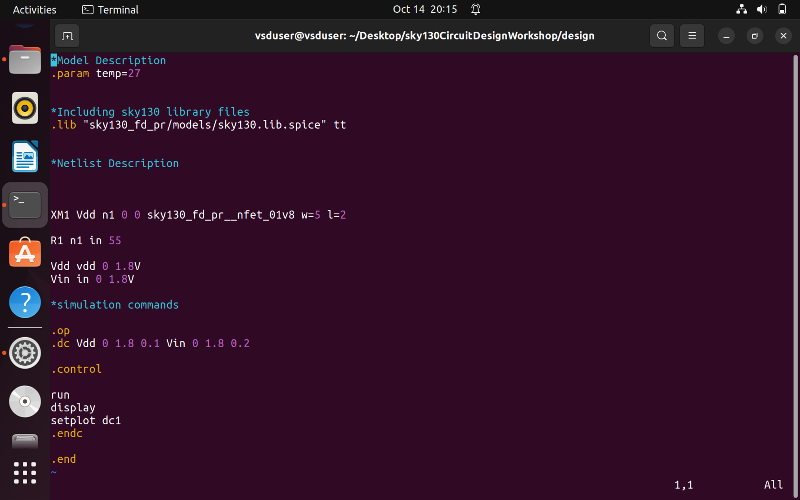

Above, we see Vdd changing from 0 to 1.8 V in 0.1 V steps, and Vgs changing from 0 to 1.8 V in 0.2 V steps.

Let's run a SPICE simulation:
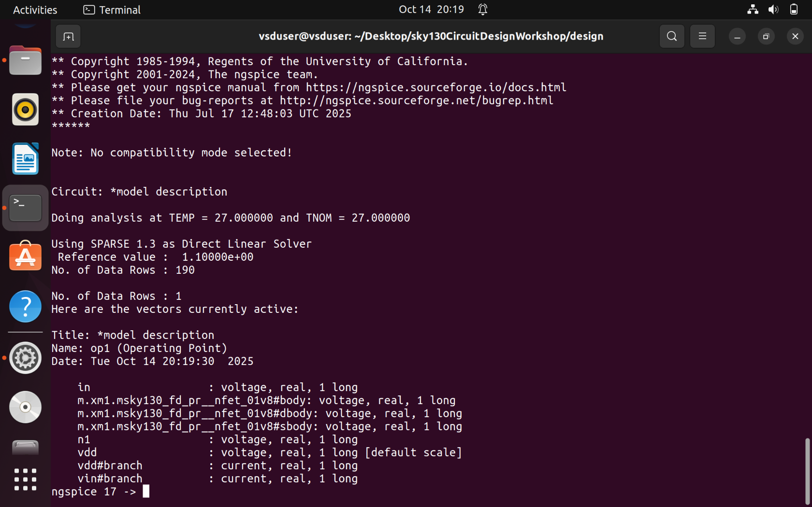

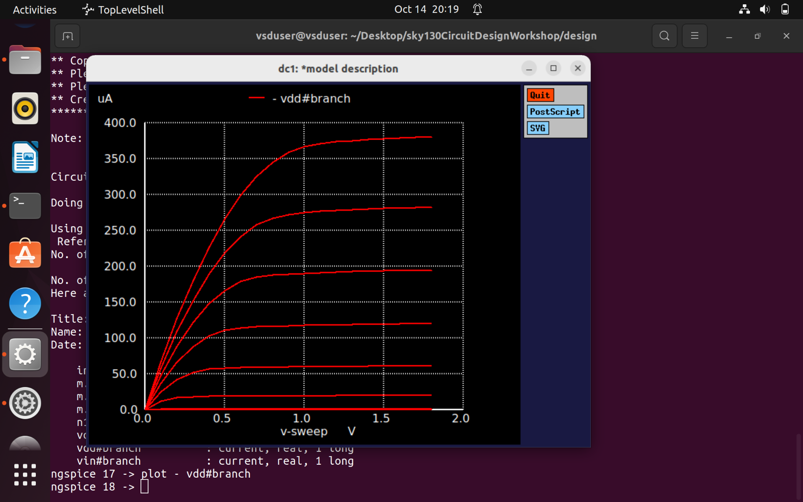

We'll get a plot of Id versus Vds for different Vgs values. 

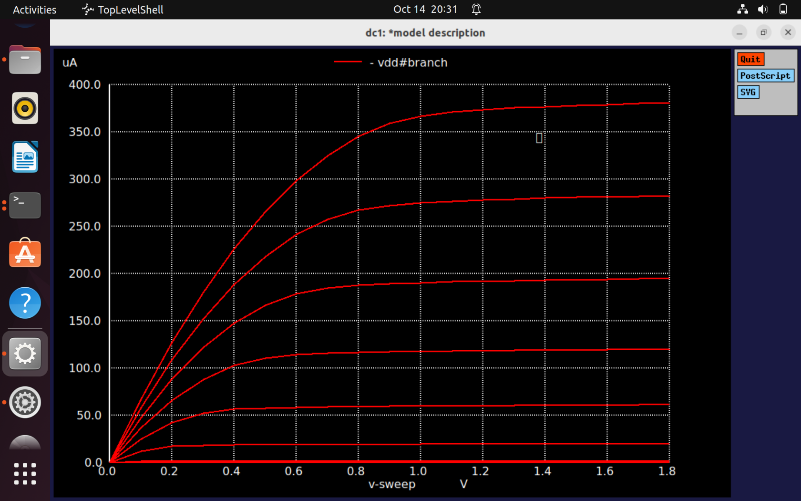
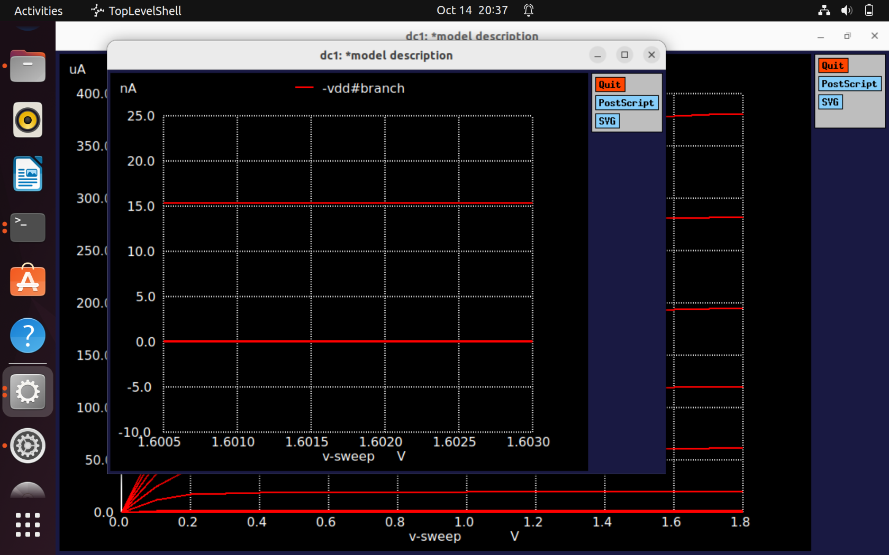

To check the Id value for the corresponding Vds and Vgs, simply left-click and see. 

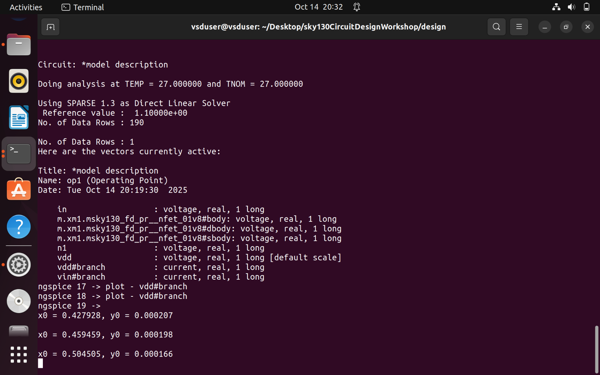

### SPICE Lab L5 with Sky130 Models
If we go to the `models` folder, we'll see the `all.spice` file. Opening it, we see a width and length scale. 
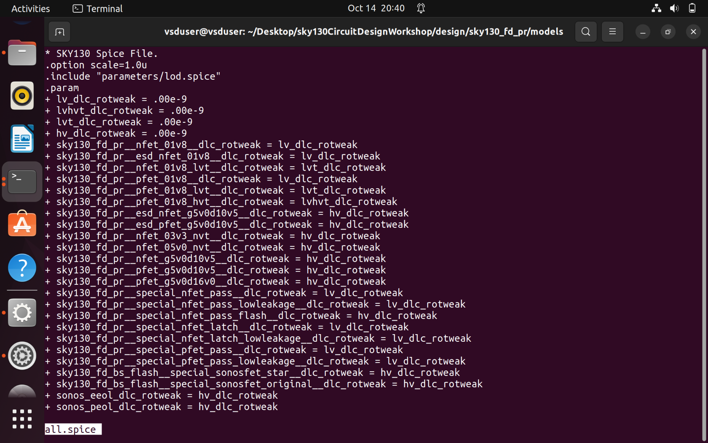

We see that the W and L values ​​are in microns. 
