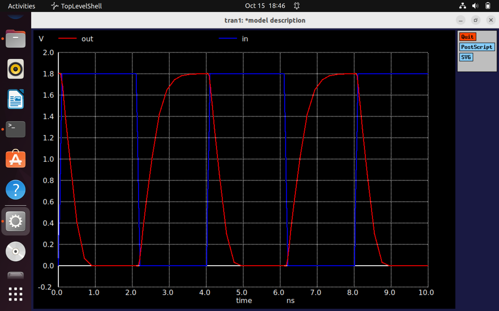

# NgspiceSky130-Day3-CMOS switching threshold and dynamic simulations

## Voltage transfer characteristics-SPICE simulations

### L1 SPICE deck creation for CMOS inverter
We will now simulate the VTC. For that we need to **create the SPICE deck**. It is a connectivity information (Netlist). As there is information about substrate, the circuit is as shown below. Here M1 is PMOS and M2 is NMOS. 

Next, we will write down the **Component Values**, keeping W/L for both NMOS and PMOS same. 

Next, we will assume the **Vin and Vout values**. 

Next step is to **Identify the Nodes** (Node is the point where two components meet). 

**Name the nodes** — In the model file we will mention like, 2.5V input lies between Vin and 0, similarly Vdd lies between vdd and 0. 

Now let us write the SPICE deck: 

We know for MOSFET the syntax is DGSS (Drain, Gate, Source, and Substrate).

---

### L2 SPICE simulation for CMOS inverter

Next comes the **Simulation Commands**. 
Here we will be sweeping the gate input voltage from 0 to 2.5V with steps of 0.05. We need to find the VTC; for this only we will be sweeping the input voltage and measuring the output voltage. 
Final step is to describe the **Model files** — all the information about the technological parameters is given inside the model files. 

Now we will do the SPICE simulation for Wn=Wp=0.375µm, Ln=Lp=0.25µm, Wn/Ln=Wp/Lp=1.5. Below is the VTC we get for the above netlist. 

Next, we will get the VTC for Wn=0.375µm, Wp=0.9375µm, Ln,p=0.25µm; Wn/Ln=1.5, Wp/Lp=2.5 (PMOS width is 2.5 times more than NMOS). 

If we observe, the previous graph is left-shifted slightly. This happens because NMOS is stronger than PMOS in the previous graph. 

---

### L3 Labs Sky130 SPICE simulation for CMOS
We now get the VTC characteristics. 

We are using both PFET and NFET for CMOS inverter. We can see that W/L ratio of PMOS is 2.33 times greater than that of NMOS. We sweep Vin from 0 to 1.8V with step size of 0.01V and plot Vout. 

To get the plot, type `ngspice` and `plot out vs in`. 

Now we need to know the Switching Threshold from this graph, it is the point when Vin=Vout. 
To zoom in the curve, press right mouse button + hold it. 

So switching threshold for W/L=2.3 is around **0.876V**. 

We will now see the transient analysis: 
For that, go inside the transient SPICE file for Day3. 

We can see that it is for typical corner as before and the W/L is also same. But now we are taking transient pulse from 0V to 1V with rise and fall times of 0.1ns each, pulse width of 2ns, and total time period of 4ns. Let us run this. 

For rise delay and fall delay, consider 50% of output curve i.e., at 0.9V; out-in. 

Therefore **Rise delay = 2.482ns - 2.15ns = 0.333ns**. 

For fall delay, consider while falling: 

Therefore **Fall delay = 4.334ns - 4.050ns = 0.285ns**. 

---

## Static behaviour evaluation-CMOS inverter robustness-Switching Threshold

### L1 Switching Threshold, Vm
Let us compare the two different CMOS inverters with different W/L ratios of PMOS and NMOS. We can see that the shape of the VTC is the same in both cases; only the switching threshold is different. This shows the robustness of the CMOS inverter. 

Let us find out the Switching Threshold, Vm, in both cases by drawing a 45° line. 

So, in the first case Vm ≈ 0.9V and in the second case Vm = 1.2V. 

This is the area where PMOS and NMOS both are in saturation region. Current flows through both transistors — a dangerous situation. 

---

### L2 Analytical expression of Vm as a function of (W/L)n and (W/L)p
We will now calculate the value of Vm with respect to the NMOS and PMOS width and length. 

---

### L3 Analytical expression of (W/L)n and (W/L)p as a function of Vm
Now, we will calculate the value of W/L for PMOS and NMOS when Vm is given. 
We move in reverse fashion, as we need to calculate W/L ratio such that the switching threshold is exactly half of the power supply Vdd = 2.5V, therefore required Vm = 1.25V. 
We will start from the current equation itself: **Idsn = -Idsp**. 

Expanding Kp and Kn (Gain factors): 

On the RHS, all are constants and we will get the values from the model files except Vm. If we know Vm, we can get the W/L ratios. 
So this allows us to find for what value of W/L ratio PMOS will be greater than NMOS based on Vm. 

---

### L4 Static and Dynamic simulation of CMOS inverter
* For (W/L)n = (W/L)p = 1.5 
  

  We can also calculate the "Rise Delay" and "Fall Delay" using transient analysis, as before. 
  

---

### L5 Static and Dynamic simulation of CMOS inverter with increased PMOS width
We will perform SPICE simulations for increased width of PMOS transistors and compare results. 

* (W/L)p = 2(W/L)n 
  

We can see that Vm has now increased as PMOS has become stronger, needing more current to charge the output load capacitor. 

* (W/L)p = 3(W/L)n 
  

*Note: Rise delay decreases with increased PMOS width — larger area reduces charging time of the output capacitor.* 

---

### L6 Applications of CMOS inverter in clock network and STA
The final dataset obtained from above experiments is shown below: 

#### Conclusions:
* During fabrication, there can be slight variation in PMOS/NMOS sizes, but CMOS inverter robustness ensures minimal change in Vm.
* When (W/L)p = 2(W/L)n, **rise and fall delays are approximately equal** — this shows the "symmetry" of CMOS inverter.

  *This is a typical characteristic of Clock Inverter/Buffer, where rise delay and fall delay must be equal.* 
  

* Other types of cells can be used according to the data path requirement.
