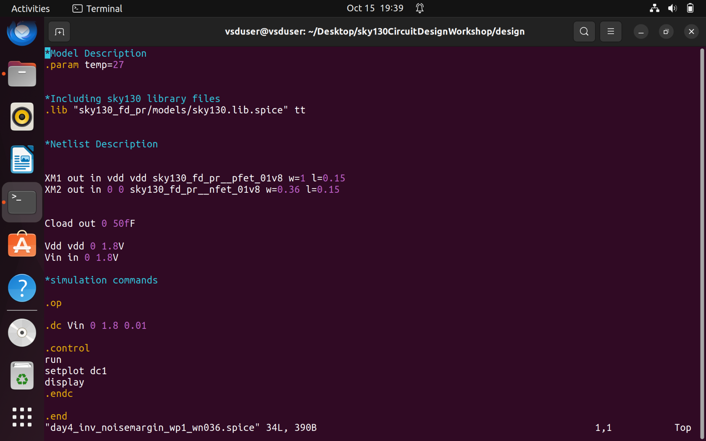
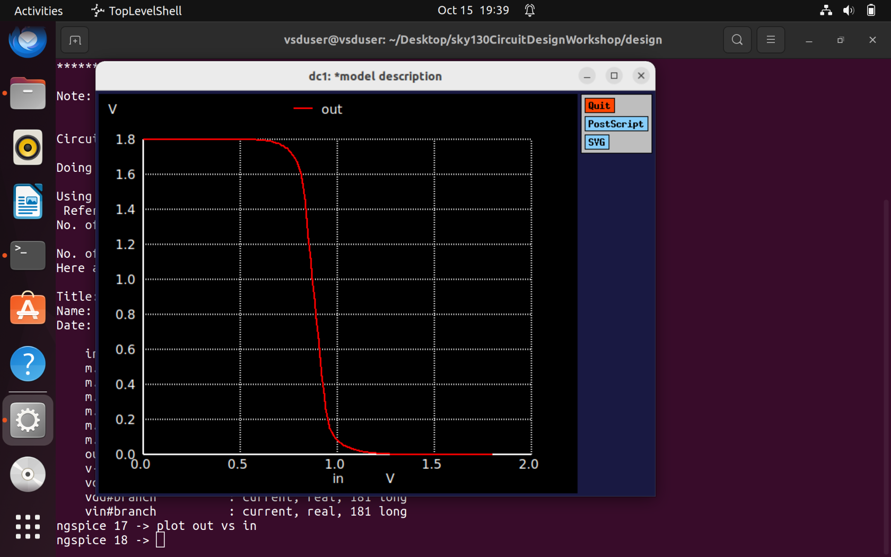
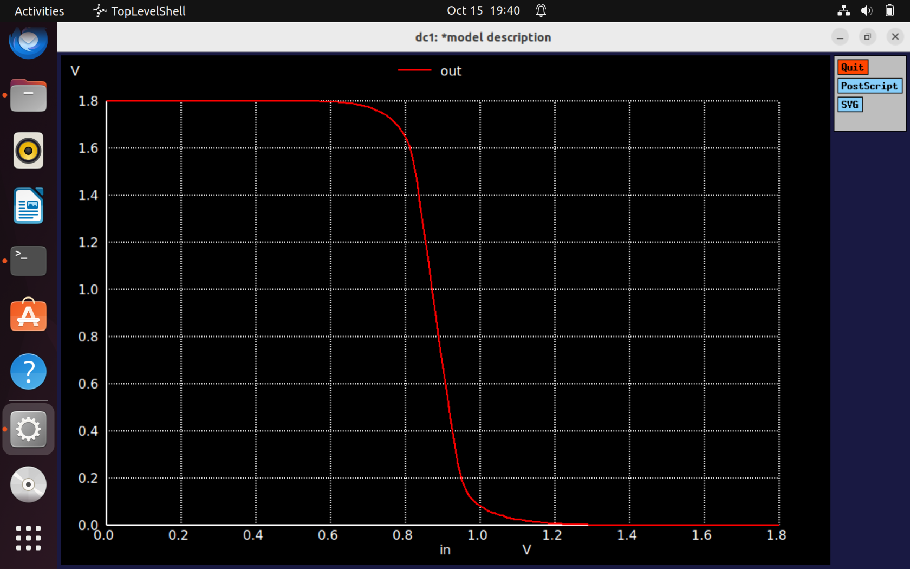
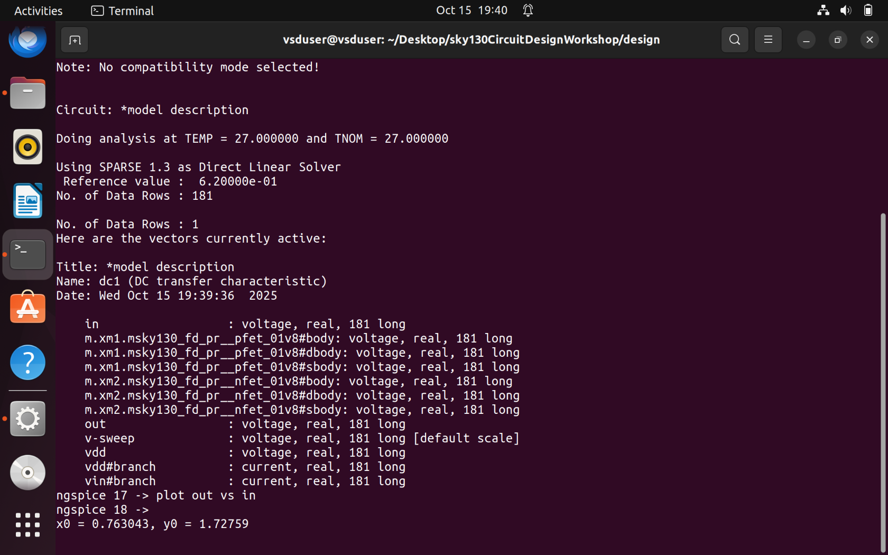
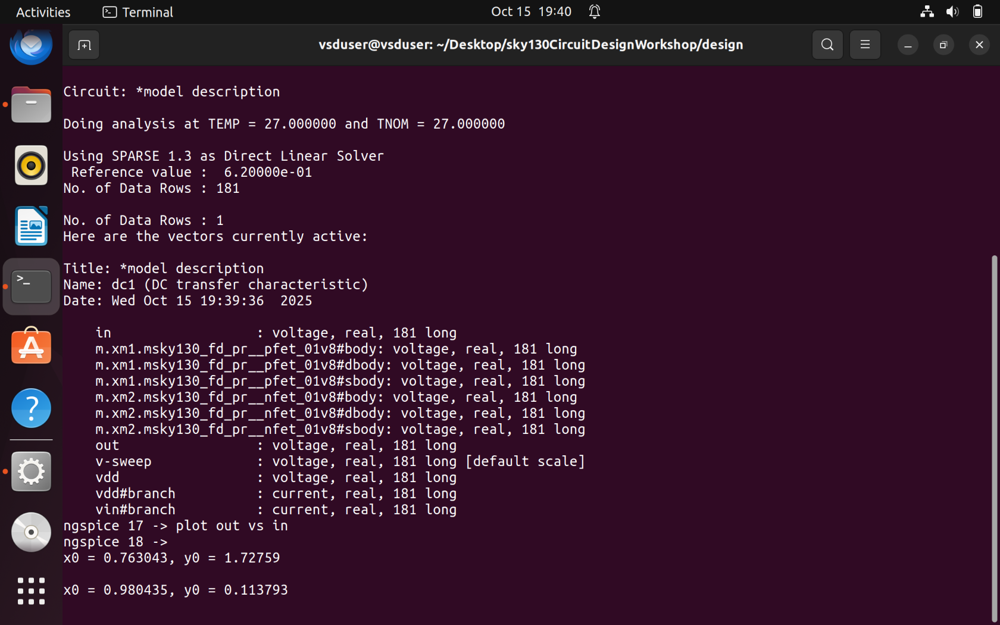

# NgspiceSky130-Day4-CMOS Noise Margin robustness evaluation

## Static behaviour evaluation-CMOS inverter robustness-Noise Margin

### L1 Introduction to Noise Margin
Now we will learn CMOS inverter's robustness towards the Noise Margin. Also we see the Noise margin evaluation for CMOS inverter.  
**Noise Margin**: It is a measure of how much unwanted electrical noise a logic circuit can tolerate on its input without producing an incorrect output.  

For example if we consider an ideal Inverter, for inputs 0/1 it gives output as 1/0. The slope of switch is infinite.  

But practically the slope won't be infinite, due to presence of resistances and capacitances there will be delay. Therefore we will get a finite slope  

We will now see that whenever the input is between 0 to VIL(input low voltage); the output will be VOH(output high).  
And whenever the input is between VIH(input high voltage) and Vdd; output will be VOL(output low voltage).  

### L2 Noise Margin voltage paramters
Considering the more practical scenarios and non idealities of an inverter, the curve we get is as shown below. So here the when the 0<Vin<VIL --> output is VOH<Vout<Vdd ; and when the input is VOL<Vin<Vdd --> output is 0<Vout<VOL. Also **VOL<VOH<Vdd** as VOH will be output high for the next inverter which will be connected and **0<VOL<VIL** as it will be the output low for the next inverter.  

Also, the slope is approximately -1, as for increase in input, output is reducing.  

### L3 Noise margin equation and summary
Now we will calculate the noise margin equation, for that we will plot the voltages on the same scale. 

In the above scale:  
* **Noise amrgin High NH** - value between VIH and VOH.  
* **Noise Margin Low NL** - value between VIL and VOL.  

So, any value which lies in between noise margins is considered either 1/0 and considered to be tolerable. Apart from this region the value is "Undefined" and the logic level can swing between 'high' and 'low'.

### L4 Noise margin variation with respect to PMOS width
We will evaluate the noise margin depending upon the PMOS width and ultimately prove that how CMOS inverter is robust to the noise margins. 
First, we will find the points where the slope = -1 and extend the lines towards x-y axis. 

The larger the Noise margin, stronger is CMOS inverter and immune to Noises. 

For (W/L)p=4(W/L)p and (W/L)p=5(W/L)p noise margins are same, so even if we increase the widths further noise margin will be static. 

Here also we can verify the robustness of CMOS inverter.  

Also we come to know the ranges for "Digital design" and "Analog design" in the CMOS inverter. 

### L5 Sky130 Noise margin labs
We will now plot Noise margins

We are taking the W/L ratios of PMOS to NMOS as 2.77 and sweeping the Vin from 0 to 1.8V with stepsize of 0.01V.

We will take the point where the slope is -1 ; x axis will give VIL and VIH, whereas y axis will give VOH and VOL.

**Noise margin NH = VOH - VIH = 1.70952-0.98778 = 0.72**  
**Noise margin NL = VIL - VOL = 0.7733-0.09523 = 0.67807**  
