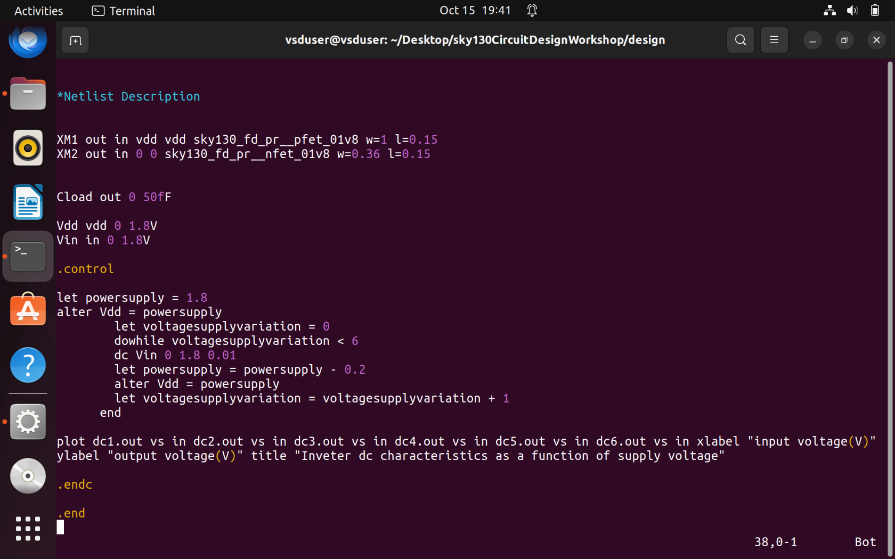
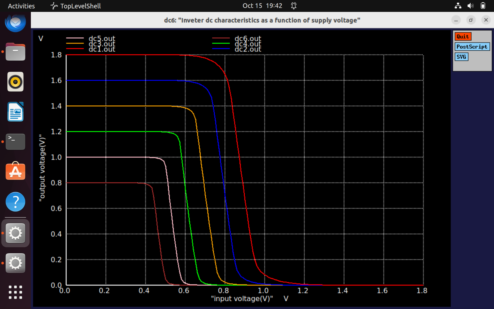
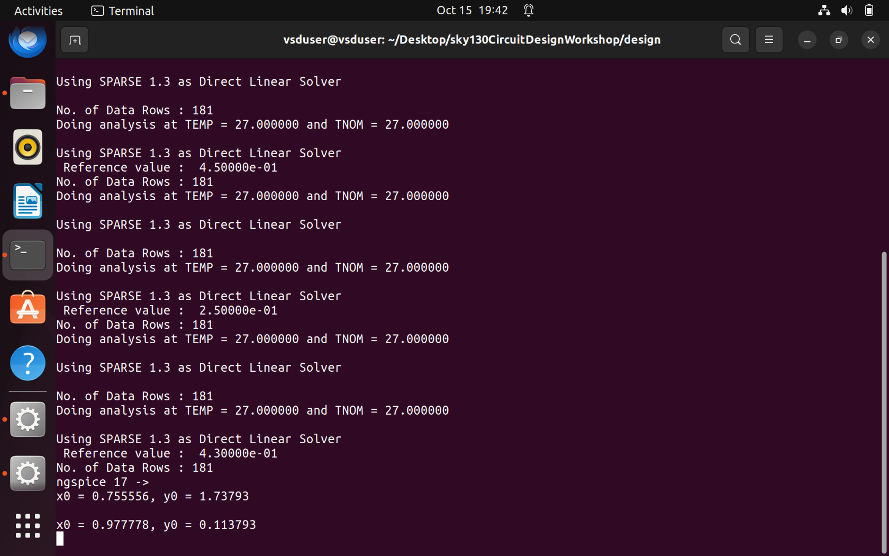
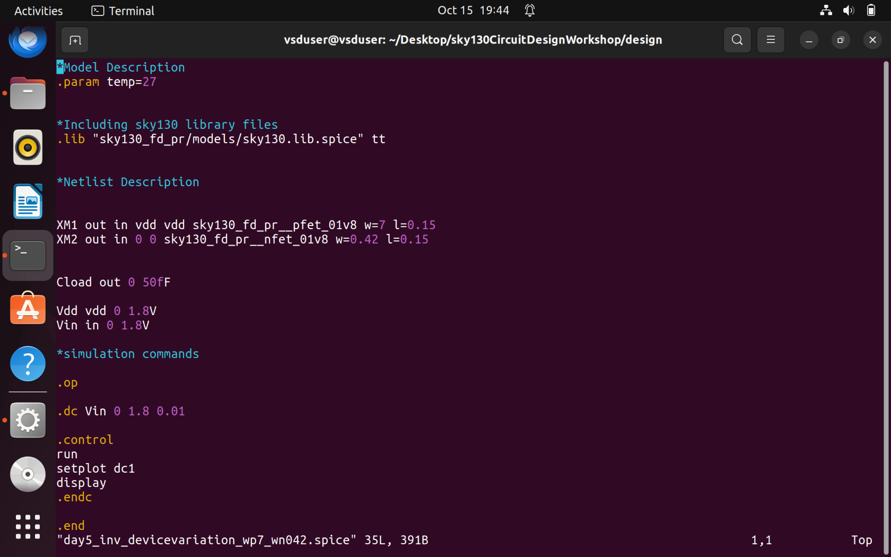
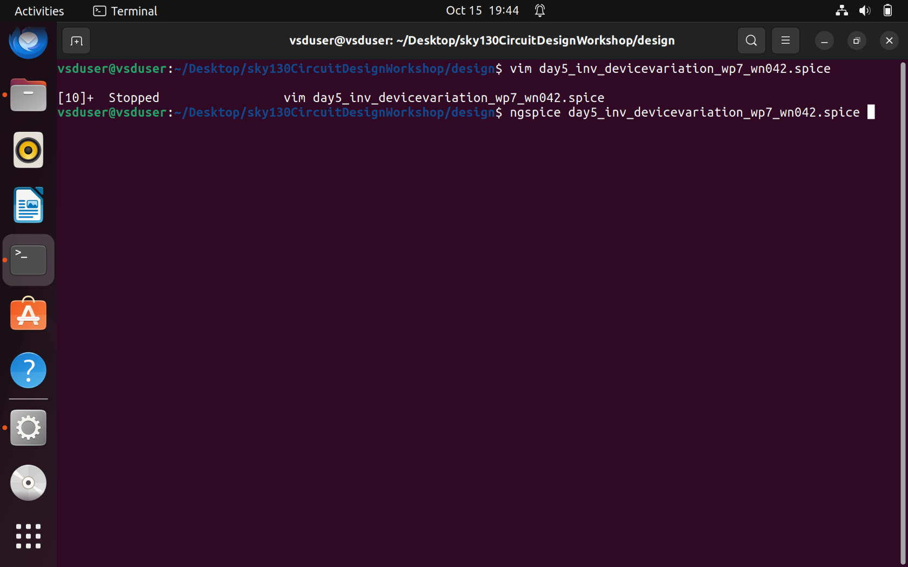
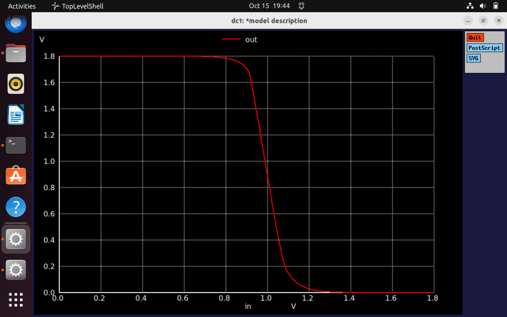
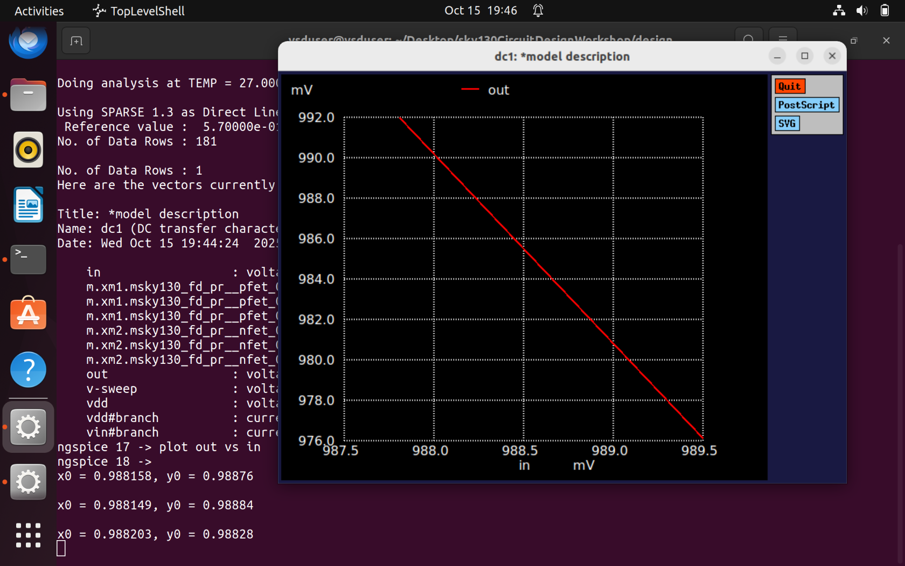

# NgspiceSky130-Day5 — CMOS Power Supply and Device Variation Robustness Evaluation

## Static Behavior Evaluation — CMOS Inverter Robustness under Power Supply Variation

### L1 Smart SPICE Simulations for Power Supply Variations
When assessing the robustness of a CMOS inverter, **power supply scaling** is an important factor. As gate length is reduced, operating power decreases. Ideally, CMOS characteristics remain consistent under supply scaling.  

To validate this, two cases were simulated:

The voltage transfer characteristics (VTC) were plotted for **Vdd = 2.5V, 2.0V, 1.5V, 1.0V, and 0.5V**:

### L2 Advantages and Disadvantages of Low Supply Voltage
The simulated VTCs were analyzed to determine the benefits and trade-offs of reduced supply voltage. The **gain factor** (ΔVout / ΔVin) was used to compare behavior across Vdd values.

Simulations show energy consumption decreases with lower Vdd:

**Advantages of low supply voltage**
- Lower dynamic energy per switching event.
- Reduced overall power consumption in many operating regimes.

**Disadvantages**
- Slower charging/discharging of load capacitances — increases rise and fall delays and degrades performance at low Vdd.

### L3 Sky130 Supply Variation Lab
Supply was swept from **1.8V** downward in **0.2V** steps (six iterations) and the gain was computed for each step:

Example result:
- **Vdd = 1.8V → |Gain| = 7.6229**

## Static Behavior Evaluation — CMOS Inverter Robustness under Device Variation

### L1 Sources of Variation — Etching Process
Etching can introduce variations in gate length (L) and width (W). In layout views, the polysilicon-diffusion overlap area and edges reveal where variations are most likely. Device dimensions may vary more at edges than at the center, causing changes in drain current across devices and across an inverter chain.

### L2 Sources of Variation — Oxide Thickness
Variations in gate oxide thickness (tox) change the gate capacitance (Cox = εox / tox) and therefore affect drain current. Cross-sectional views illustrate differences between ideal and actual tox values.

### L3 Smart SPICE Simulation for Device Variations
SPICE simulations examined extreme device cases: **strong PMOS / weak NMOS** (larger PMOS width — lower resistance) and **strong NMOS / weak PMOS** (larger NMOS width). VTC shifts and noise margins were observed for these conditions.

### L4 Conclusions
From the simulated data:

- The switching threshold \(V_m\) shifts **right** when PMOS is strong and **left** when NMOS is strong.
  

- Noise margins do not vary significantly in these extreme cases, indicating the inverter remains robust across the tested device variations.

### L5 Sky130 Device Variation Lab
SPICE setups show PMOS width significantly larger than NMOS (strong PMOS / weak NMOS), causing the VM to be right-shifted:

